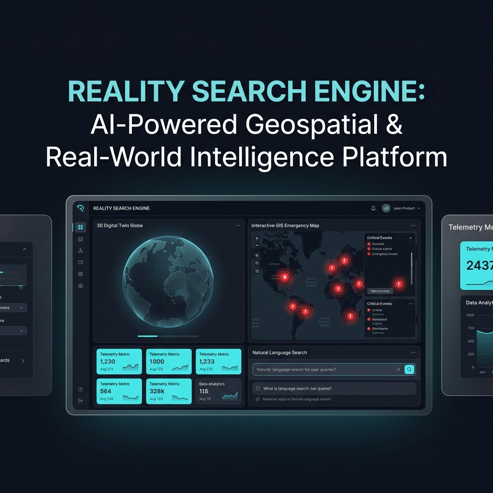
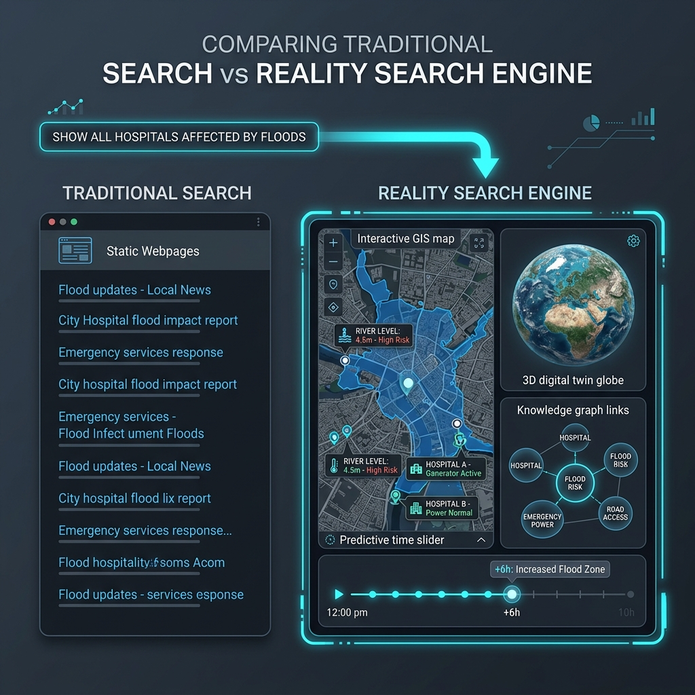
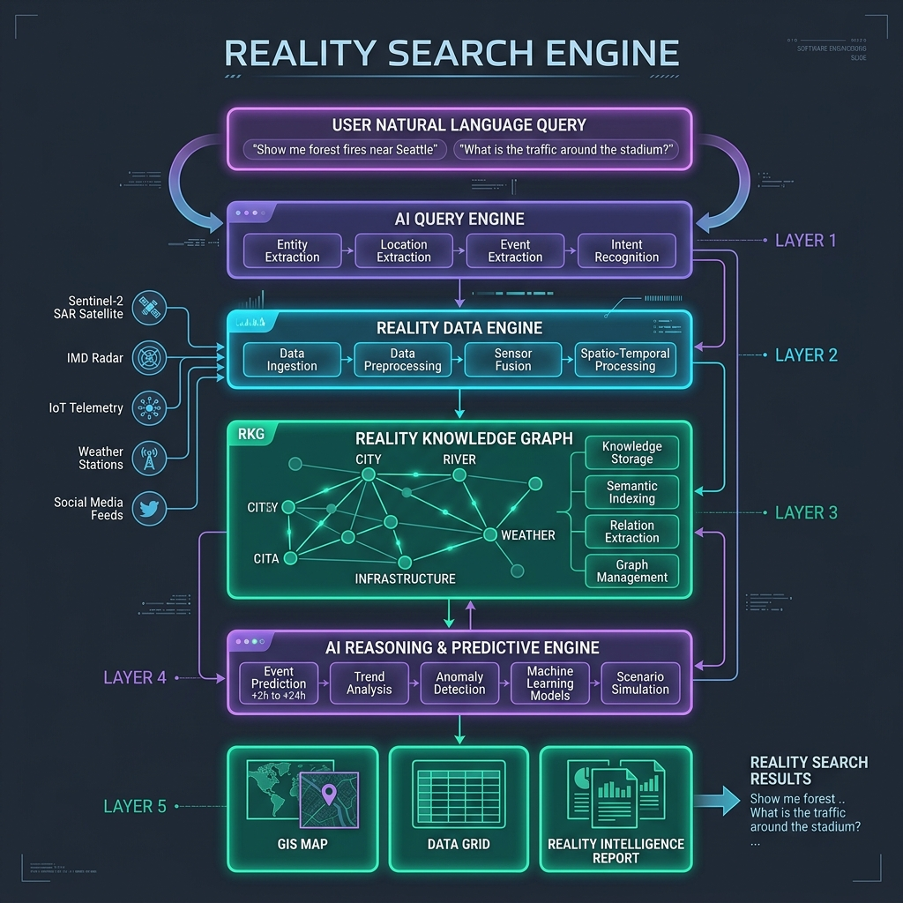
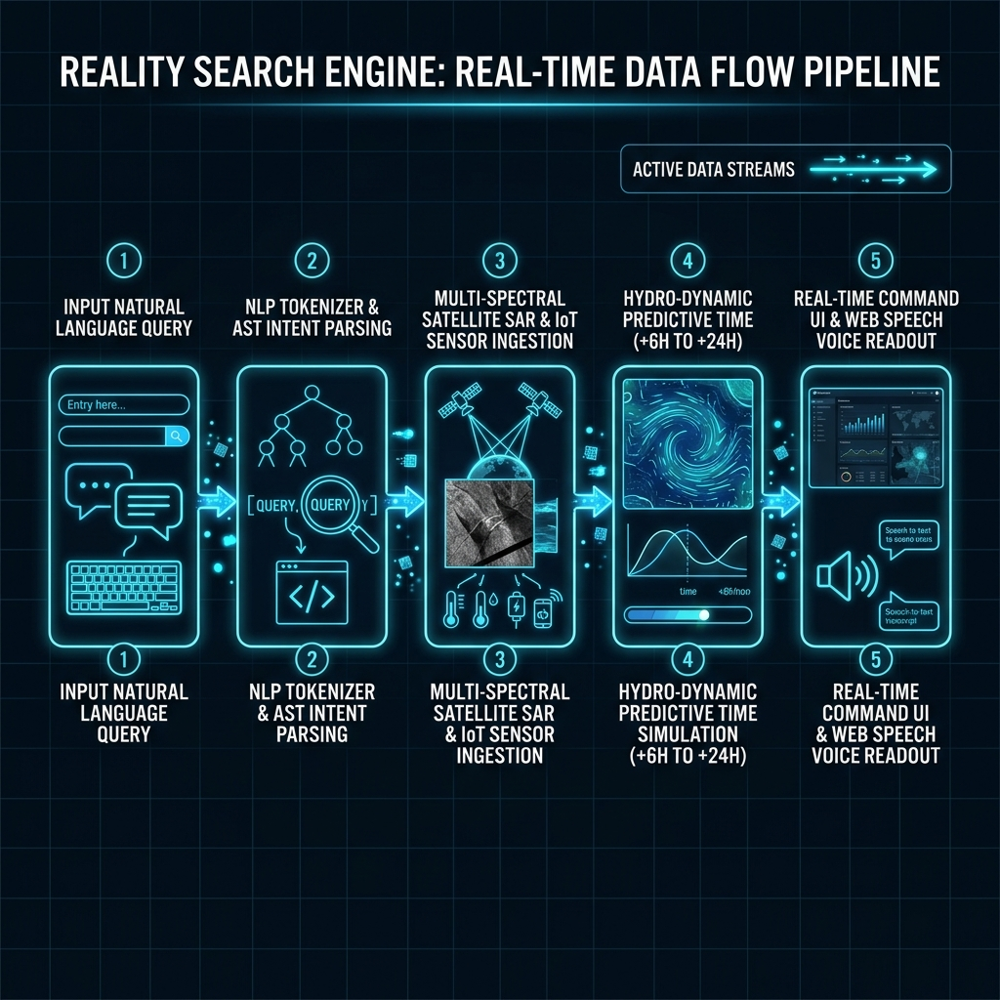
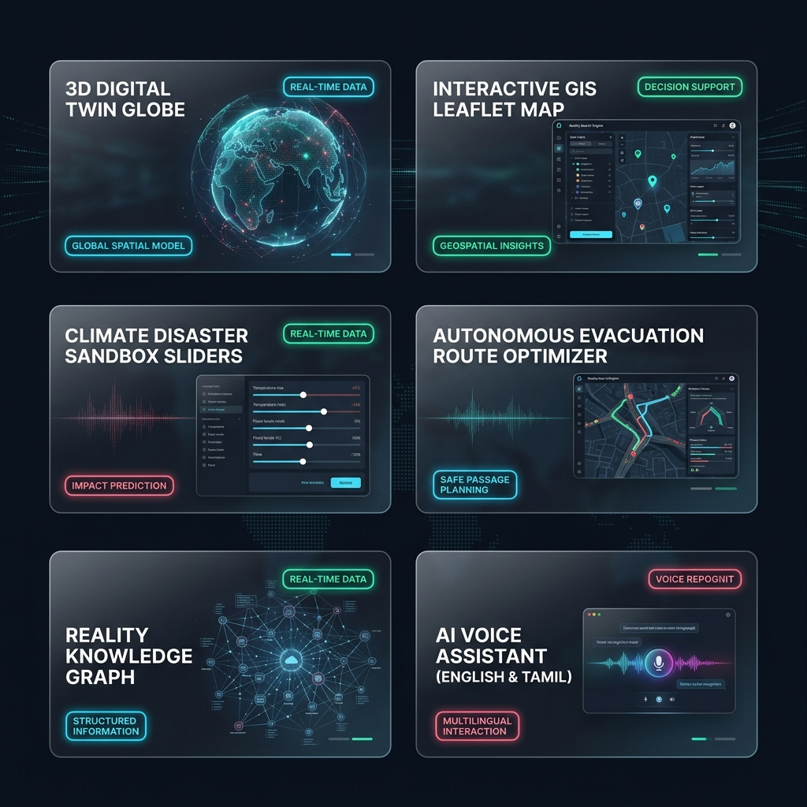
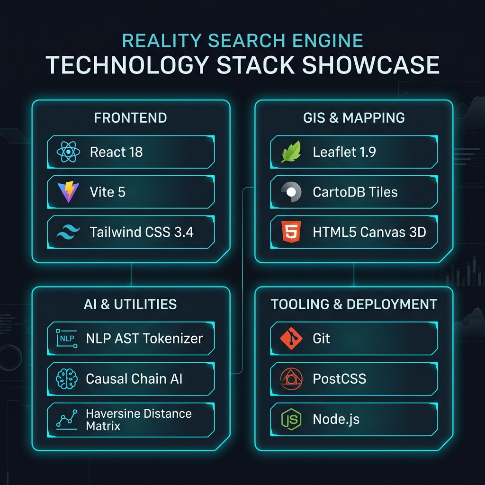
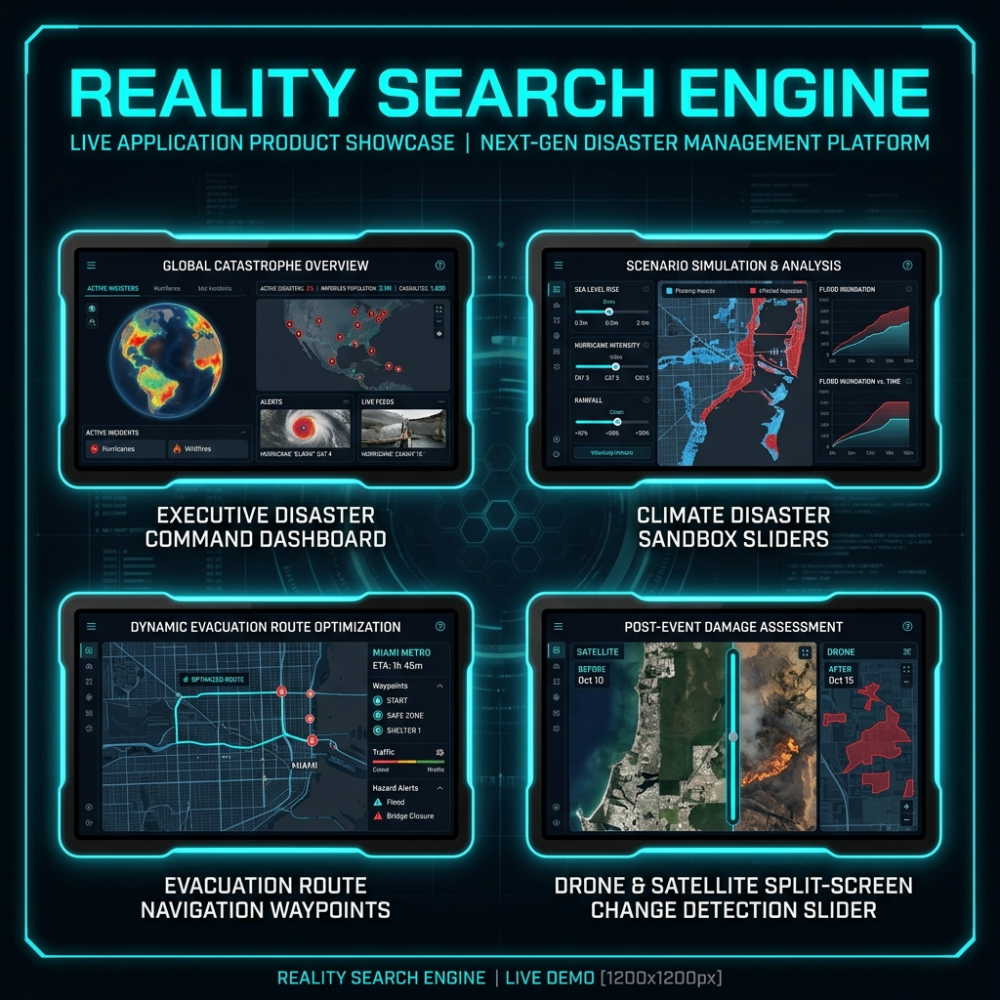

<div align="center">

# 🌐 Reality Search Engine — LinkedIn Visual Showcase

### *AI-Powered Geospatial & Real-World Intelligence Platform*

[](https://github.com/vijaymahes9080/Reality-Search-Engine)
[](https://reactjs.org/)
[](https://vitejs.dev/)
[](https://leafletjs.com/)

</div>

---

## 🖼️ Slide 1 — Project Hero
> *"What did this developer build?"*

<div align="center">

</div>

---

## 🖼️ Slide 2 — Problem → Solution
> *"Traditional search returns links. Reality Search Engine returns real-world intelligence."*

<div align="center">

</div>

---

## 🖼️ Slide 3 — System Architecture
> *"How it works: NLP Query → AI Engine → Satellite/IoT Data → GIS Intelligence Report."*

<div align="center">

</div>

---

## 🖼️ Slide 4 — Real-Time Data Flow
> *"5-stage processing pipeline: NLP Tokenizer → SAR Ingestion → Predictive Simulation → Command UI."*

<div align="center">

</div>

---

## 🖼️ Slide 5 — Feature Showcase
> *"6 core implemented modules — from 3D Globe to AI Voice Assistant."*

<div align="center">

</div>

---

## 🖼️ Slide 6 — Technology Stack
> *"The full tech stack powering this platform."*

<div align="center">

</div>

---

## 🖼️ Slide 7 — Live Application
> *"The actual running application — Command Dashboard, Sandbox, Route Optimizer & Drone Inspector."*

<div align="center">

</div>

---

## 📋 LinkedIn Post Caption (Copy & Paste)

```
🚀 I built the Reality Search Engine — an AI-Powered Geospatial Intelligence Platform
that doesn't return 10 blue links. It returns REAL-WORLD INTELLIGENCE.

Ask: "Show all hospitals affected by floods in Tamil Nadu"
Get: Interactive GIS Maps, 3D Digital Twin Globe, Predictive Timeline, Knowledge Graph & more.

🗺️  Leaflet 1.9 + CartoDB Dark Matter Satellite Tiles
🌐  HTML5 Canvas 3D Digital Twin Globe (Sentinel-2 SAR Orbital Tracks)
🎛️  Disaster Sandbox (Rainfall 10→300 mm/h, Dam Outflow, Tidal Surge)
🧭  Autonomous Evacuation Route Optimizer (GIS Pathfinding)
🕸️  Reality Knowledge Graph (Entity → Event → Location)
🎙️  AI Voice Assistant with English & Tamil தமிழ் UI Toggle
📡  IoT Hydro-Sensor Telemetry Stream
🛡️  Multi-Source Satellite Evidence Inspector

💻 React 18 | Vite 5 | Tailwind CSS | Leaflet 1.9 | HTML5 Canvas 3D

🔗 Open Source: https://github.com/vijaymahes9080/Reality-Search-Engine

Swipe to see the full technical showcase 👉

#AI #React #GIS #Geospatial #WebDevelopment #OpenSource #Innovation
#DisasterManagement #TamilNadu #MCA #FullStack #JavaScript #ReactJS
```

---

<div align="center">

⭐ **Star the repo if you find it useful!**

[](https://github.com/vijaymahes9080/Reality-Search-Engine)

</div>
