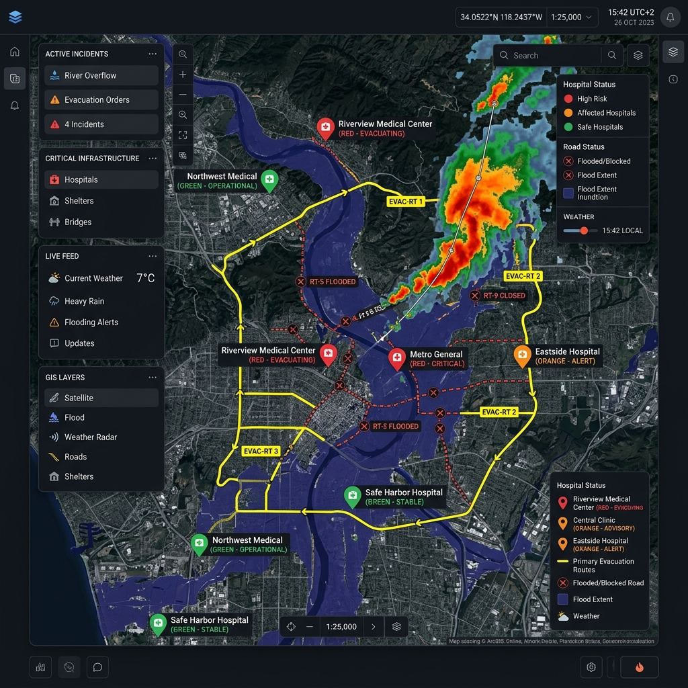

<div align="center">

# 🌐 Reality Search Engine

### *AI-Powered Search & Geospatial Intelligence Platform for Understanding Real-World Situations, Entities, Events, Risks, and Multi-Source Evidence.*


[](https://vijaymahes9080.github.io/Reality-Search-Engine)

<br/>


</div>

---

## 📌 What is Reality Search Engine?

Traditional search engines index **webpages and text links**. The **Reality Search Engine** queries **real-world situations, physical entities, environmental risks, geospatial relationships, and empirical evidence**.

> Instead of returning 10 blue links, a query such as:
>
> *"Show all hospitals affected by floods in Tamil Nadu"*
>
> produces a **full-spectrum intelligence report**.

<div align="center">

| 🗺️ Interactive GIS Map & 3D Globe | 📊 Structured Intelligence Data Grid | 🕸️ Reality Knowledge Graph |
|:---:|:---:|:---:|
| Plotted entities, risk severity circles, road accessibility status, satellite imagery overlays | Searchable entity metrics, hospital bed capacity, ICU availability, CSV export | Entity → Event → Location → Road Accessibility relationship vectors |

| 🔮 AI Predictive Engine & Time Simulation | 🛡️ Multi-Source Evidence Inspector | 🎛️ Disaster Simulation Sandbox |
|:---:|:---:|:---:|
| +2h to +24h hydro-dynamic risk progression forecasting | Cross-verified Satellite SAR, Weather Radar, Government Emergency Bulletins, and IoT feeds | Live climate sliders for rainfall intensity, dam outflow, and sea surge |

| 🧭 Autonomous Evacuation Route Optimizer | 🎙️ AI Voice Assistant & Regional Language Support |
|:---:|:---:|
| Turn-by-turn GIS navigation bypassing submerged roads | Text-To-Speech telemetry readouts with English & Tamil UI toggle |

</div>

---

## 🏗️ Core Architecture

<div align="center">

```text
                                 USER
                                   │
                                   ▼
                        Natural Language Query
                                   │
                                   ▼
                         AI Query Engine
                                   │
        ┌──────────────────────────┼──────────────────────────┐
        ▼                          ▼                          ▼
   Entity                     Location                     Event & Time
 Extraction                  Extraction                     Extraction
        │                          │                          │
        └──────────────────────────┼──────────────────────────┘
                                   ▼
                        Reality Data Engine
                                   │
     ┌─────────────────────────────┼─────────────────────────────┐
     ▼                             ▼                             ▼
 Satellite                       Weather                    Government &
   Data                           Radar                       Sensor IoT
     │                             │                             │
     ├─────────────────────────────┼─────────────────────────────┤
     ▼                             ▼                             ▼
    GIS                        Knowledge                     Web/Data
   Engine                        Graph                        Sources
                                   │
                                   ▼
                         AI Reasoning Engine
                                   │
        ┌──────────────────────────┼──────────────────────────┐
        ▼                          ▼                          ▼
     GIS MAP /                STRUCTURED                  PREDICTIVE
     3D GLOBE                 DATA GRID                   TIMELINE
        │                          │                          │
        └──────────────────────────┼──────────────────────────┘
                                   ▼
                     Reality Intelligence Report
```

</div>

---

## 📸 Visual Platform Showcase

<div align="center">

| 🗺️ Interactive GIS Emergency Map & Telemetry | 🕸️ Reality Knowledge Graph & Threat Vectors |
|:---:|:---:|
|  |  |

</div>

---

## 🔥 Key Features & Innovation Modules

<table>
<tr>
<td width="50%" valign="top">

### 🌐 1. Interactive 3D Digital Twin Globe
- Canvas-rendered rotating 3D Earth globe with longitude/latitude spatial grid
- Visualizes orbital trajectories for **Sentinel-2 SAR** and **MODIS** satellites
- Projects real-world entities directly onto 3D spherical space

</td>
<td width="50%" valign="top">

### 🗺️ 2. GIS Interactive Map Component
- Powered by **Leaflet 1.9** with custom dark tiles (`CartoDB.DarkMatter`) + Satellite Hybrid overlay
- Layer toggles: Satellite Imagery, Weather Radar Overlay, Flood Contours, Emergency Shelters
- Color-coded pulsing markers:
  - 🔴 **High Risk / Inundated** (Pulsing ring animation)
  - 🟠 **Affected**
  - 🟢 **Safe / Operational**
  - 🟣 **Predicted Risk (+6h)**

</td>
</tr>
<tr>
<td width="50%" valign="top">

### 🎛️ 3. Disaster Simulation Sandbox Engine
- Dynamic climate sliders allowing emergency commanders to tweak parameters in real time:
  - **Rainfall Intensity** (10 mm/h → 300 mm/h)
  - **Dam Discharge Outflow** (2,000 → 60,000 cusecs)
  - **Tidal Surge Elevation** (0.0m → 4.0m)
- Calculates real-time flood severity scores, high-risk entity surge counts, and evacuation lead times

</td>
<td width="50%" valign="top">

### 🧭 4. Autonomous Evacuation Route Optimizer
- Identifies flood-free evacuation corridors bypassing submerged road segments
- Turn-by-turn guidance for emergency response drivers with distance and time estimates (68.5 km, 1h 14m)

</td>
</tr>
<tr>
<td colspan="2" align="center" valign="top">

### 🎙️ 5. AI Voice Assistant & Multi-Language Support
- Speech synthesis text-to-speech audio telemetry readout (*"Alert: 34 high-risk hospitals in Tamil Nadu..."*)
- Instant UI translation between **English** and **Tamil (தமிழ்)** for regional emergency responders

</td>
</tr>
</table>

---

## 🛠️ Technology Stack

<div align="center">


</div>

| Tier | Technologies Used |
|:---|:---|
| **Frontend Framework** | React 18, Vite 5, JavaScript (ES2023) |
| **Styling & UI** | Tailwind CSS 3.4, Lucide Icons, Glassmorphism UI Tokens |
| **GIS & Mapping** | Leaflet 1.9, React-Leaflet, CartoDB Tiles, Esri Satellite, OpenWeather Radar |
| **Data & State** | React Hooks, i18n Localization Engine, HTML5 Canvas 3D |
| **Build & Tooling** | Vite, PostCSS, Autoprefixer, Git |

---

## 📂 Directory Structure

```text
Reality-Search-Engine/
├── index.html
├── package.json
├── vite.config.js
├── tailwind.config.js
├── postcss.config.js
├── README.md
├── LICENSE
├── .gitignore
└── src/
    ├── main.jsx
    ├── index.css
    ├── App.jsx
    ├── components/
    │   ├── Navbar.jsx
    │   ├── SearchBar.jsx
    │   ├── QueryBreakdown.jsx
    │   ├── MapView.jsx
    │   ├── Globe3DView.jsx
    │   ├── DataGrid.jsx
    │   ├── KnowledgeGraph.jsx
    │   ├── PredictionTimeline.jsx
    │   ├── EvidenceInspector.jsx
    │   ├── ScenarioSandbox.jsx
    │   ├── RouteOptimizer.jsx
    │   ├── DroneInspector.jsx
    │   ├── IoTSensorStream.jsx
    │   ├── AIVoiceAssistant.jsx
    │   ├── EntityDrawer.jsx
    │   └── ReportModal.jsx
    ├── data/
    │   └── scenarios.js
    └── utils/
        ├── queryParser.js
        ├── reportGenerator.js
        └── i18n.js
```

---

## 🚀 Getting Started

<div align="center">


</div>

### 📋 Installation & Local Setup

**1️⃣ Clone the Repository**
```bash
git clone https://github.com/vijaymahes9080/Reality-Search-Engine.git
cd Reality-Search-Engine
```

**2️⃣ Install Dependencies**
```bash
npm install
```

**3️⃣ Start Development Server**
```bash
npm run dev
```
🌐 Open your browser at `http://localhost:3000`

**4️⃣ Build Production Bundle**
```bash
npm run build
```

---

## 🤝 Contributing

Contributions are what make the open source community amazing. Any contributions you make are **greatly appreciated**.

<div align="center">


</div>

---

## 📜 License

Distributed under the **MIT License**. See [`LICENSE`](LICENSE) for more details.


---

## 👨‍💻 Developer & Author

<div align="center">

### **Vijay Mahes**


---

### ⭐ Star this repo if you find it useful!


</div>

